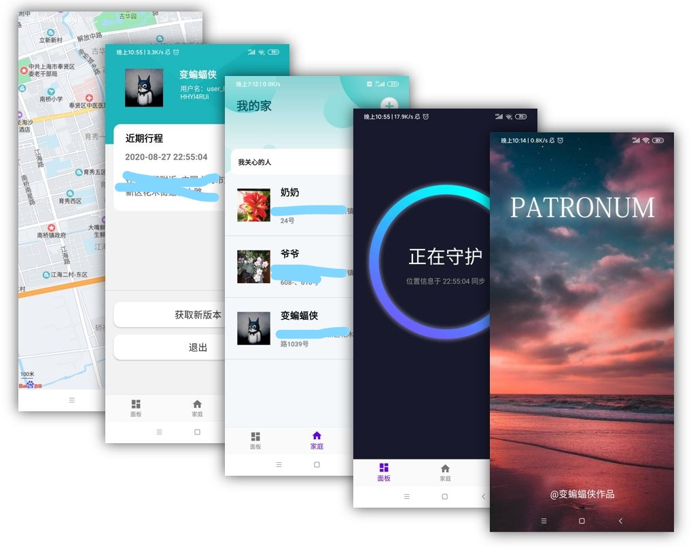

# Patronum
保护你关心的人。 
Android + Spring boot + MySQL   

纪念一下在测试了一个月后，终于把工程部署到云上了。原本是直接运行在家里的物理机上的，但前几天运营商频繁变更 IP 地址导致时不时无法访问服务，也便加速了部署过程。

这个项目是一个月前开始启动的。那段时间爷爷开始放疗，每天来回于家和医院，更糟的是，这个声称上海国际医学中的地方竟然在靠近迪士尼的地方，导致路上花去相当长的时间。要是能知道爷爷什么时候可以放疗完、什么时候可以到家就好了。也正是那时，我开始构思这个项目。

为了能尽快给家人使用，便加急花了一周时间完成了第一版，那时离我入职只剩两天了。也正是这一版本，从时常崩溃到稳定运行至今，期间花了一些业余时间陆续修复了大部分能察觉的bug，除了UI差一些，用户体验遭一点，也没有其他问题了，查询家人位置的功能已经稳定。本想部署到云端，但自从没有了学生认证之后，云服务器没有了优惠，便犹豫不决，只是先部署在家里的服务器上。

转折发生在上周四晚上，妈妈说看不到爷爷的位置了。由于我设置了服务器只能内网登录ssh，而我工作日住在公司附近，因此只能等周末回去再调试，猜测可能是bug。直到回到家后，才注意到IP变了，随后运营商几乎每隔半天就变一次家里的IP，继续部署在家里是不可能了。于是计划一周之内把后台移植到818买的腾讯云上。

这周，爷爷的放疗结束了，开始住院做全身检查。家里人轮流来回照顾爷爷。我却只能看着，帮不上什么忙。前两天，妈妈跟我说，最近看不到其他人的位置，来回路上不放心。我没想到，自己开发的一款 APP 竟然可以让她产生依赖。也便是这两天，公司刚好考完c++，才有了时间，顺便把之前重新设计的UI一起更新了。

这算是我开发的第一款能24小时不间断运行30多天的应用了，虽然用户就只有家人，但也满足了。事实上，仅仅几个用户就够我喝一壶了，比如说，当我更新了一个自认为好看的界面并兴致勃勃安装到爷爷的手机上后，发现他的手机字体是大号的，因此界面会变得混乱或者显示不全。如何解决？还是没想到很好的方案，只能尽量适配。

团队开发有需求、编码、测试、维护等一系列流水线，而我单枪匹马做所有这些，个何况只能在业余时间做，还是很累人的。

